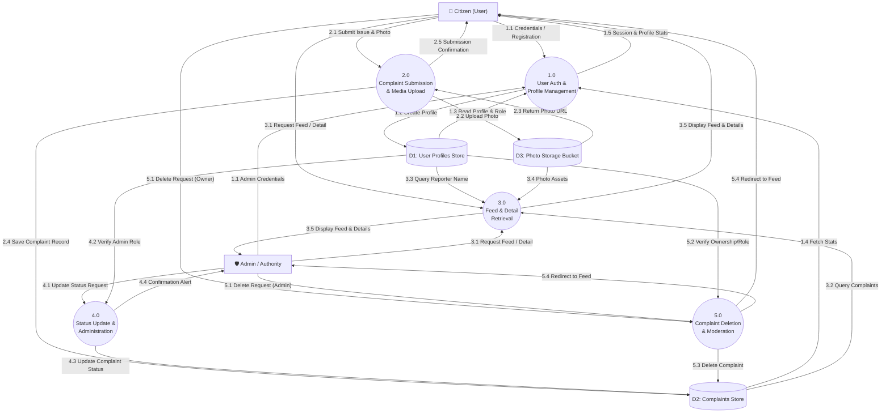

# Project Overview: Ovijog (অভিযোগ) - Civic Issue Reporting & Resolution System

This document provides a comprehensive technical overview and structured Data Flow breakdown of **Ovijog**, designed specifically to easily generate **DFD Level 0 (Context Diagram)** and **DFD Level 1 (Subsystem Decomposition Diagram)** in any AI tool or diagramming software.

---

## 1. System Summary & Purpose
**Ovijog (অভিযোগ)** is a civic reporting and resolution mobile platform built with **React Native / Expo** and powered by **Supabase**. It empowers citizens to report urban and community problems (such as road damages, garbage, water leaks, electricity failures) with photo evidence and location tracking. Local authorities and administrators can review reports, monitor real-time civic issues, update resolution progress, and manage the complaints lifecycle.

---

## 2. Key Actors / External Entities

| Entity | Description |
| :--- | :--- |
| **Citizen (General User)** | Registers/logs in, submits civic complaints with photos/location, views complaints feed and details, tracks personal submission stats, and deletes self-submitted complaints. |
| **Admin / Authority** | Authenticated staff/moderator with administrative privileges (`role = 'admin'`). Reviews all incoming civic issues, updates resolution status (`pending` $\rightarrow$ `in_progress` $\rightarrow$ `resolved`), and manages/moderates any complaint. |

---

## 3. Data Stores

| Data Store ID | Name | Description / Schema Attributes |
| :--- | :--- | :--- |
| **D1** | **User Profiles Store** (`profiles` table) | `id`, `full_name`, `email`, `role` (`citizen` \| `admin`), `created_at` |
| **D2** | **Complaints Store** (`complaints` table) | `id`, `user_id`, `category`, `title`, `description`, `location_text`, `photo_url`, `status` (`pending` \| `in_progress` \| `resolved`), `created_at` |
| **D3** | **Photo Storage Bucket** (`complaint-photos` storage) | Media asset storage holding uploaded image evidence files and returning public image URLs. |

---

## 4. DFD Level 1: Subsystem Processes Breakdown

### Process 1.0: User Authentication & Profile Management
- **Description**: Handles user signup, signin, session persistence with AsyncStorage, role resolution, and fetching profile statistics.
- **Inputs**:
  - `User Registration Data` (Full Name, Email, Password) from **Citizen**
  - `Login Credentials` (Email, Password) from **Citizen / Admin**
- **Data Store Interactions**:
  - Writes new user profile record to **D1: User Profiles Store**
  - Reads user credentials and profile role from **D1: User Profiles Store**
  - Reads user complaint count & status stats from **D2: Complaints Store**
- **Outputs**:
  - `Auth Session / Token` to **Citizen / Admin**
  - `Profile Details & Stats` (Total, Pending, Resolved) to **Citizen / Admin**

---

### Process 2.0: Complaint Submission & Media Uploading
- **Description**: Captures civic issue reports, uploads photo evidence to cloud storage, and stores structured issue records.
- **Inputs**:
  - `Complaint Data` (Category, Title, Description, Location Text) from **Citizen**
  - `Photo Asset / Image File` (via Camera / Gallery) from **Citizen**
- **Data Store Interactions**:
  - Writes binary image file to **D3: Photo Storage Bucket** and retrieves `photo_url`
  - Writes new complaint record linked to `user_id` and `photo_url` into **D2: Complaints Store**
- **Outputs**:
  - `Submission Confirmation / Alert` to **Citizen**

---

### Process 3.0: Complaint Feed & Detail Retrieval
- **Description**: Queries, filters, and renders civic issues for public viewing and individual tracking.
- **Inputs**:
  - `View Feed Request` / `Screen Focus Trigger` from **Citizen / Admin**
  - `Select Complaint Request` (Complaint ID) from **Citizen / Admin**
- **Data Store Interactions**:
  - Reads list of complaints (sorted chronologically) from **D2: Complaints Store**
  - Reads reporter metadata (`full_name`) by joining with **D1: User Profiles Store**
  - Reads photo assets via `photo_url` from **D3: Photo Storage Bucket**
- **Outputs**:
  - `Civic Issues Feed List` to **Citizen / Admin**
  - `Detailed Complaint View` (Title, Description, Status, Photo, Location, Reporter Name, Timestamp) to **Citizen / Admin**

---

### Process 4.0: Status Update & Administration
- **Description**: Allows verified administrators to manage civic issue resolution status.
- **Inputs**:
  - `Admin Verification Request` (Session User ID) from **Admin**
  - `Status Update Action` (`pending`, `in_progress`, `resolved` + Complaint ID) from **Admin**
- **Data Store Interactions**:
  - Reads & validates `role == 'admin'` from **D1: User Profiles Store**
  - Reads all incoming complaints from **D2: Complaints Store**
  - Updates `status` field in **D2: Complaints Store**
- **Outputs**:
  - `Admin Complaint Dashboard Data` to **Admin**
  - `Status Update Notification / Confirmation` to **Admin**
  - Updated complaint status reflected in **Process 3.0 (Feed)**

---

### Process 5.0: Complaint Deletion & Moderation
- **Description**: Handles secure complaint removal based on ownership permissions or admin rights.
- **Inputs**:
  - `Delete Request` (Complaint ID, User ID) from **Citizen (Author)** or **Admin**
- **Data Store Interactions**:
  - Validates permission against **D1: User Profiles Store** (role) and **D2: Complaints Store** (`user_id`)
  - Deletes complaint record from **D2: Complaints Store**
- **Outputs**:
  - `Deletion Confirmation & Redirect` to **Citizen / Admin**

---

## 5. Complete Data Flow Matrix (DFD Level 1)

| Source | Data Flow | Destination Process / Store |
| :--- | :--- | :--- |
| **Citizen** | Registration Details / Login Credentials | **1.0 User Authentication** |
| **1.0 User Authentication** | Store New Profile Data | **D1: User Profiles Store** |
| **D1: User Profiles Store** | Profile & Role Information | **1.0 User Authentication** |
| **D2: Complaints Store** | User Complaints Count & Statuses | **1.0 User Authentication** |
| **1.0 User Authentication** | Auth Token & Profile Stats | **Citizen** |
| **Citizen** | Issue Details & Image Attachment | **2.0 Complaint Submission** |
| **2.0 Complaint Submission** | Raw Image File | **D3: Photo Storage Bucket** |
| **D3: Photo Storage Bucket** | Public Photo URL | **2.0 Complaint Submission** |
| **2.0 Complaint Submission** | Structured Issue Record (with Photo URL) | **D2: Complaints Store** |
| **2.0 Complaint Submission** | Submission Status Alert | **Citizen** |
| **Citizen / Admin** | Feed / Complaint Detail Request | **3.0 Feed & Detail Retrieval** |
| **D2: Complaints Store** | Complaints Data Records | **3.0 Feed & Detail Retrieval** |
| **D1: User Profiles Store** | Reporter Details | **3.0 Feed & Detail Retrieval** |
| **D3: Photo Storage Bucket** | Complaint Image Stream | **3.0 Feed & Detail Retrieval** |
| **3.0 Feed & Detail Retrieval** | Rendered Feed & Details Screen | **Citizen / Admin** |
| **Admin** | Status Update Request (`status`, `id`) | **4.0 Status Update & Administration** |
| **D1: User Profiles Store** | Admin Role Verification | **4.0 Status Update & Administration** |
| **4.0 Status Update & Administration**| Updated Status Record | **D2: Complaints Store** |
| **4.0 Status Update & Administration**| Update Status Confirmation | **Admin** |
| **Citizen / Admin** | Delete Complaint Request | **5.0 Complaint Deletion** |
| **5.0 Complaint Deletion** | Remove Record (`id`) | **D2: Complaints Store** |
| **5.0 Complaint Deletion** | Deletion Status & Redirect | **Citizen / Admin** |

---

## 6. Mermaid Diagram (DFD Level 1)
*(Copy-paste this directly into Mermaid Live Editor or any Markdown viewer supporting Mermaid)*

---

## 7. AI Prompt Template (For Direct Diagram Generation)
If your teammate wants to generate DFD Level 1 diagrams in ChatGPT, Claude, DeepSeek, or draw.io, they can use this prompt:

> **Prompt to copy-paste:**
> *"Based on the Project Overview below for 'Ovijog', create a detailed Data Flow Diagram (DFD) Level 1. Clearly show External Entities, Data Stores (D1, D2, D3), Processes (1.0 to 5.0), and labeled directional data flows between all components in [PlantUML / Mermaid / Draw.io XML / ASCII format].*
> 
> *[Paste Sections 1 to 5 from this document]*"
